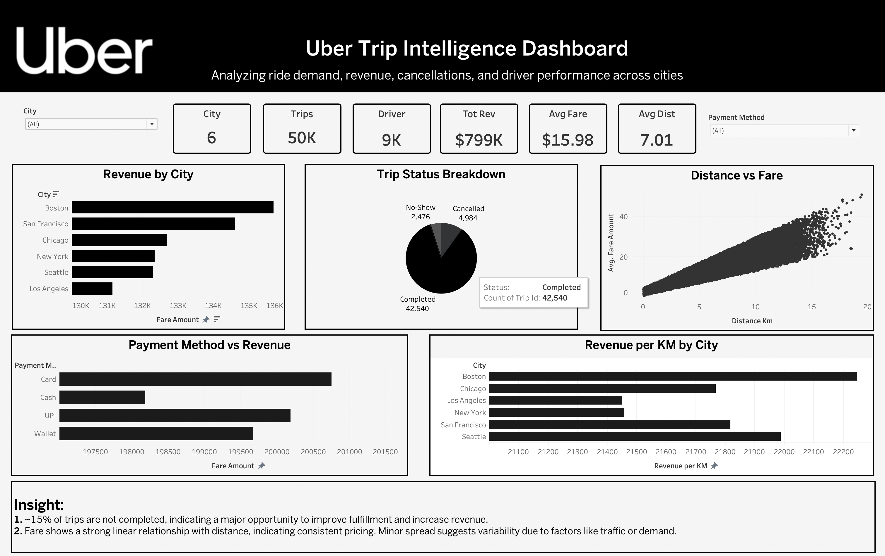

# 🚗 Uber Trip Intelligence Dashboard

## 📊 Overview

This project presents a **data-driven analysis of Uber trips** using an interactive dashboard built in Tableau. The dashboard provides insights into **ride demand, revenue distribution, pricing efficiency, cancellations, and driver utilization** across multiple cities.

It is designed to simulate how a **real-world ride-hailing company like Uber** would analyze operational and business performance.

---

## 🖼️ Dashboard Preview



---

## 🎯 Objectives

* Analyze **trip demand patterns**
* Identify **revenue distribution across cities**
* Evaluate **pricing efficiency (Revenue per KM)**
* Understand **trip completion and cancellation trends**
* Assess **driver utilization**

---

## 📁 Dataset

* **Total Trips:** 50,000
* **Total Drivers:** 9,000
* **Cities Covered:** 6
* **Fields Included:**

  * Trip ID, Driver ID, City
  * Pickup & Drop Time
  * Distance (km)
  * Fare Amount
  * Payment Method
  * Trip Status

---

## 📌 Key Metrics (KPIs)

* **Total Revenue:** $799K
* **Average Fare:** $15.98
* **Average Distance:** 7.01 km
* **Trips per Driver:** ~5.5
* **Completion Rate:** ~85%

---

## 📊 Dashboard Components

### 1. Revenue by City

* Displays total revenue generated across cities
* **Insight:** Revenue is relatively evenly distributed, indicating no single dominant market

---

### 2. Trip Status Breakdown

* Shows Completed vs Cancelled vs No-show trips
* **Insight:**

  * ~15% of trips are not completed
  * Indicates **significant revenue leakage and operational inefficiency**

---

### 3. Distance vs Fare (Scatter Plot)

* Visualizes relationship between trip distance and fare
* **Insight:**

  * Strong linear relationship
  * Indicates **consistent and predictable pricing model**

---

### 4. Payment Method vs Revenue

* Shows contribution of each payment method
* **Insight:**

  * Balanced usage across payment methods
  * Suggests **diverse customer payment preferences**

---

### 5. Revenue per KM by City

* Measures pricing efficiency across cities
* **Formula:**

  ```
  Revenue per KM = SUM(Fare Amount) / SUM(Distance Km)
  ```
* **Insight:**

  * Minor variation across cities
  * Indicates **standardized pricing with slight regional differences**

---

## 🧠 Key Insights

1. **High Cancellation Rate (~15%)**

   * Major opportunity to improve fulfillment
   * Potential to increase revenue without acquiring new users

2. **Consistent Pricing Model**

   * Fare increases linearly with distance
   * Suggests strong pricing control

3. **Moderate Driver Utilization**

   * ~5.5 trips per driver
   * Indicates potential inefficiency in driver allocation

4. **Balanced Revenue Distribution**

   * No single city dominates revenue
   * Business is geographically diversified

5. **Stable Revenue Efficiency**

   * Revenue per km is consistent across cities
   * Suggests uniform pricing strategy

---

## ⚠️ Limitations

* Dataset appears **synthetic**
* Uniform hourly distribution (no peak demand patterns)
* No surge pricing or traffic-based variability

---

## 🛠️ Tools Used

* Tableau (Dashboard & Visualization)
* CSV Dataset (50K records)

---

## 🚀 Future Improvements

* Add **real-world demand patterns (peak hours)**
* Include **surge pricing model**
* Analyze **driver wait times**
* Add **customer ratings & feedback analysis**
* Build a **live dashboard using React + APIs**

---

## 📎 How to Use

1. Download the `.twbx` Tableau file
2. Open in Tableau Desktop / Tableau Public
3. Interact with filters (City, Payment Method)

---

## 👨‍💻 Author

**Manpreet Singh**
Aspiring Full-Stack Developer & Data Enthusiast

---

## ⭐ If you like this project

Give it a ⭐ on GitHub and feel free to connect!
